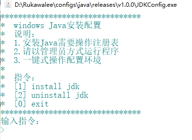

# JDKConfig

### 完善功能
    1> JDK环境配置安装
    2> JDK环境配置卸载

### 使用说明
    1> 使用管理员方式打开程序
    2> 发送指令完成需求
    3> 复制粘贴JDK文件完整路径
       例：E:\Program Files\Java\jdk-13
    4> 根据指令交互操作

### 开发目的
    1> 适用于解包版的JDK
    2> 适用于减少Windows开发者配置JDK环境的时间
    3> 将JDK环境配置复杂简单化

### 手动配置
* 系统变量
	1. 变量名：`JAVA_HOME` 变量值：JDK全路径
	2. 变量名：`CLASSPATH` 变量值：`.;%JAVA_HOME%\lib\dt.jar;%JAVA_HOME%\lib\tools.jar;`
* Path变量
	1. `%JAVA_HOME%\bin;`
	2. `%JAVA_HOME%\jre\bin;`

### 下载
[JDKConfig](v1.0.1/release)

### 历史版本

#### 2019.10.28
* [v1.0.0](./v1.0.0/release)
    * 快速配置Java环境变量

### 效果图
