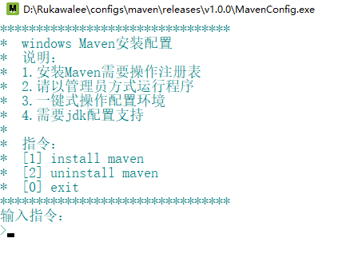

# MavenConfig
### 完善功能
    1> Maven环境配置安装
    2> Maven环境配置卸载
### 使用说明
    1> 使用管理员方式打开程序
    2> 发送指令完成需求
    3> 复制粘贴MySQL文件完整路径
       例：E:\Program Files\apache-maven-3.6.2
    4> 根据指令交互操作
### 开发目的
    1> 适用于解包版的Maven
    2> 适用于减少Windows开发者配置Maven环境的时间
    3> 将Maven环境配置复杂简单化
### 待增加功能
    1> 欢迎用户提需求..
### 下载
[MavenConfig](releases)
### 效果图
