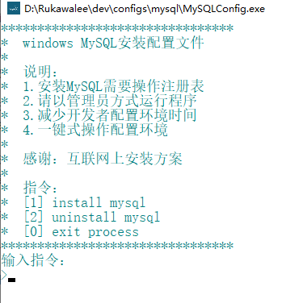
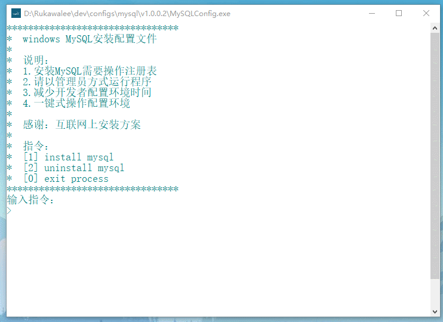
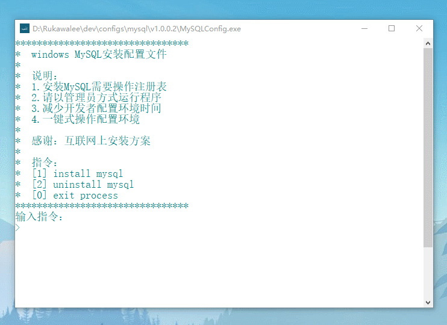

# MySQLConfig

### 完善功能
    1> MySQL环境配置安装
    2> MySQL环境配置卸载

### 使用说明
    1> 使用管理员方式打开程序
    2> 发送指令完成需求
    3> 复制粘贴MySQL文件完整路径
       例：E:\Program Files\mysql-8.0.18-winx64
    4> 根据指令交互操作

### 开发目的
    1> 适用于解包版的MySQL
    2> 适用于减少Windows开发者配置MySQL环境的时间
    3> 将MySQL环境配置复杂简单化

### 手动配置
* 系统变量
	1. 变量名：`MYSQL_HOME` 变量值：MySQL全路径
* Path变量
    1. `%MySQL_HOME%\bin`
* cmd 进入 MySQL 路径下的 bin目录 后输入`mysqld --initialize --console`
* 记录`root@localhost:`后的随机密码
* 安装 mysql 服务：`mysqld --install`
* 登入：`mysql -u root -p`输入随机密码
* 修改密码：`ALTER USER 'root'@'localhost' IDENTIFIED BY '新密码' PASSWORD EXPIRE NEVER;`

### 下载
[MySQLConfig](v1.0.1/releases)

### 历史版本

#### 2019.11.25
* [v1.0.1](./v1.0.0/release)
    * 修复环境变量太长无法设置

#### 2019.10.28
* [v1.0.0](./v1.0.0/release)
    * 快速配置MySQl环境变量
    * 安装新MySQL替换旧MySQL环境变量

### 效果图

### 使用录制
> 安装录制  

- - -
> 卸载录制  

