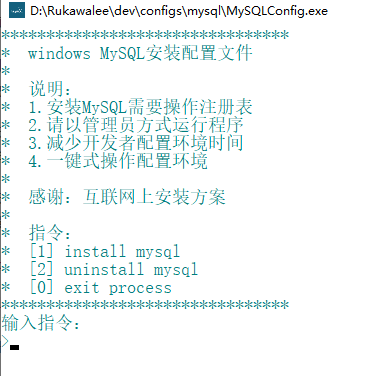
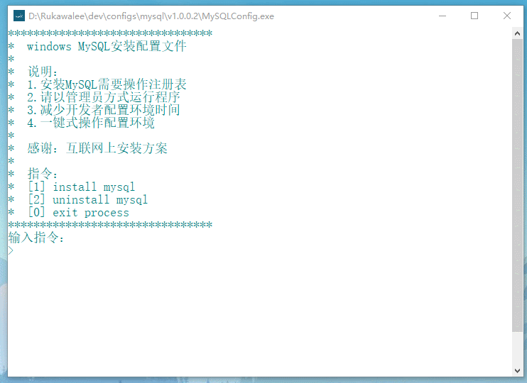
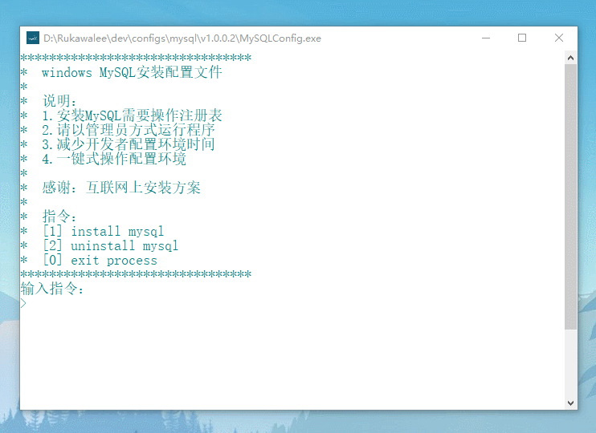

# MySQLConfig
### 完善功能
    1> MySQL环境配置安装
    2> MySQL环境配置卸载
### 使用说明
    1> 使用管理员方式打开程序
    2> 发送指令完成需求
    3> 复制粘贴MySQL文件完整路径
       例：E:\Program Files\mysql-8.0.18-winx64
    4> 根据指令交互操作
### 开发目的
    1> 适用于解包版的MySQL
    2> 适用于减少Windows开发者配置MySQL环境的时间
    3> 将MySQL环境配置复杂简单化
### 待增加功能
    1> MySQL密码忘记修改
    2> 欢迎用户提需求..
### 下载
[MySQLConfig](release)
### 效果图

### 使用录制
> 安装录制

- - -
> 卸载录制

