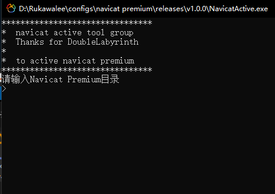

# NavicatActive

### 使用说明
    1> 运行程序
    2> 发送指令完成需求
    3> 复制粘贴Navicate文件完整路径
       例：E:\Program Files\PremiumSoft\Navicat Premium 12
    4> 根据指令交互操作

### 注意事项
    1> 使用过程中注意断网  
    2> 如有能力请支持正版

### 开发目的
    1> 集成核心快速Active
    2> 快速上手Active

### 下载
[NavicatActive](releases\v1.0.0)

### 效果图

### 引用
* [JohnHubcr](https://github.com/JohnHubcr/navicat-keygen)