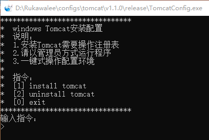

# TomcatConfig

### 完善功能
    1> Tomcat环境配置安装
    2> Tomcat环境配置卸载

### 使用说明
    1> 使用管理员方式打开程序
    2> 发送指令完成需求
    3> 复制粘贴Tomcat文件完整路径
       例：E:\Program Files\apache-tomcat-9.0.29
    4> 根据指令交互操作

### 开发目的
    1> 适用于解包版的Tomcat
    2> 适用于减少Windows开发者配置Tomcat环境的时间
    3> 将Tomcat环境配置复杂简单化

### 手动配置
* 系统变量
	1. 变量名：`CATALINA_BASE` 变量值：Tomcat全路径
	2. 变量名：`CATALINA_HOME` 变量值：Tomcat全路径
* Path变量
	1. `%CATALINA_HOME%\lib;`
	2. `%CATALINA_HOME%\bin;`

### 下载
[TomcatConfig](v1.2.0/release)

### 历史版本

### 2019.12.15
* [v1.2.0](./v1.2.0)
	* 增加配置文件用户设置
	* 默认用户：tomcat
	* 默认密码：tomcat

#### 2019.11.30
* [v1.1.0](./v1.1.0)
    * 修复环境变量太长无法设置
    * 调整文件输出情况

#### 2019.10.28
* [v1.0.0](./v1.0.0)
    * 快速配置Tomcat环境变量

### 效果图
